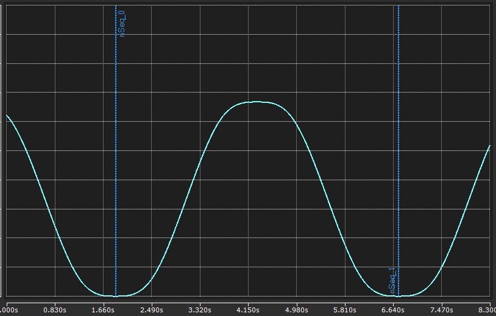
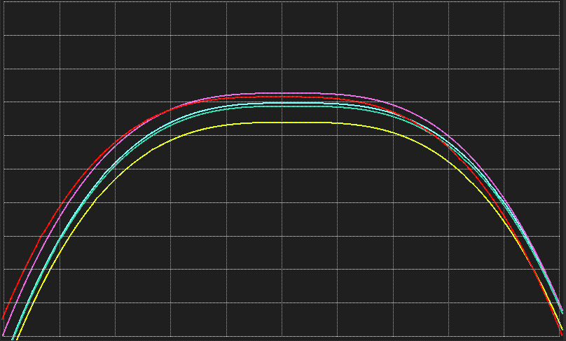
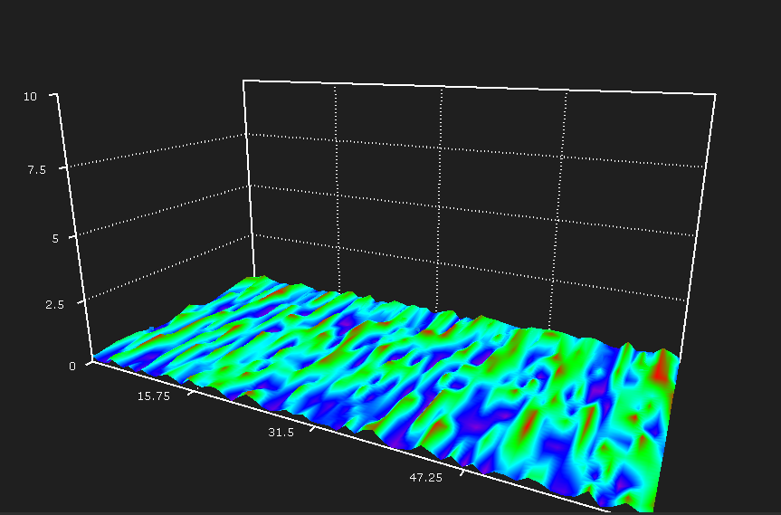

## Getting the Most out of Scope 📈

### Objectives
- Know more about Scope
  - Practical use
  - Sales arguments
  - Advanced features

### Agenda
- Intro / Presentation
- Lab 1 - The Basics
  - **ALL** the properties
  - Chart formatting, grouping
  - Triggering
  - Layering
- Lab 2 - Scope Server
  - Headless data acquisition
  - Conversion tool
- Lab 3 - New Chart Types!
  - Array Time chart
  - Table

## Lab 1 - The Basics

Open the solution. The PLC project is a simple reversing motion sequence. Activate and run, and let's create a new YT Scope project. Start by adding 3 charts to show the `SetPos` vs. `ActPos`, `SetVel` vs. `ActVel`, and `AxisState`. Use Target Browser and just drag your signals in.
> These signals can all be found in `P_ReverseSequence.fbAxis.stAxis.NcToPlc`. Use the Target Browser's filter!

Arrange the windows so that all trends are visible, and record some data.

#### ALL the Properties:

With such a feature packed tool like Scope, where the heck do you find anything? Knowing how to navigate a project <u>hierarchy</u>, and generally getting familiar with *what goes where* makes all the difference.

- Project Properties
  - Save/record
  - View detail
- Chart Properties
  - Test modifying display width and overwrite mode (you can do this "live")
- Axis Group Properties
  - Mostly visual properties of X/Y axis
- Channel Properties
  - Test modifying line width and mark size

Compare disparate values:

Move the `AxisState` channel up to the Position chart. When sharing an Axis Group with the position values, the auto Y-scaling makes the state unreadable. Create another axis group for the Position chart (right-click Chart -> New Axis) and drag `AxisState` into it. Now you have two auto-scaling Y-axes that keep your data visually aligned.

#### Triggering

Triggers are a way to automate certain behavior in Scope — most commonly, to start recording or set markers.

- Add a new Channel Trigger Set
  - In the Group, set the Trigger Action to **Start Record**
- We will use the `bStartSeq` BOOL as our trigger
  - Trigger channels must be in the DataPool first!
  - Channel Trigger Set properties:
    - Release = Rising Edge
    - Threshold = 1
    - Used Data = Acquisition: bStartSeq
  - Scope Project property: 
      - Record->Start Mode = Trigger Set

Press Start Record - it now waits for the trigger condition(s). Go over to the PLC and stop the motion sequence with `bStopSeq`. Once back in the `nSeq` 0 state, restart the sequence by writing `TRUE` to `bStartSeq`. Check back over at your Scope. Did it start? Why not? 
> Hint: The SampleMode for all items in the DataPool (default) = **Task Sampletime**.

We need at least one scan or Scope will miss the trigger. Modify the reset of `bStartSeq` with an online change (move it down to `CASE nSeq OF 1:`), then restart the motion sequence again. Now our trigger should work appropriately. Something to watch out for when trying to use internal flags as triggers.

For an analog trigger, let's say we only want to see when the axis is moving in the reverse direction (`ActVel < 0`). We can create two trigger groups with actions **Start Record**, and **Stop Record**, then set the channel trigger properties accordingly.

> Hint: If we combine this with the **Restart Record** Project-level property, the **Start Record** trigger will work without having to manually re-initiate the recording (via the button). This is particularly useful if you are also auto-saving and want to capture multiple cycles. This capability does require a **Scope Pro** license.

#### Layering

We have seen how easy it is to compare *different* channels with a YT chart in Scope (like `SetPos` vs `ActPos`). But, what if we need to compare `ActPos` *with itself* over time? Layering is a convenient way to visualize the same Y-value channel over different time snapshots. It is particularly useful with cyclic data (like what we have in this lab).

>You *can* create a layer chart without a Scope Pro license, but functionality is very limited.

- Create a YT Chart with just `ActPos` and `nSeq`
- Create a simple **Set Mark** trigger on `nSeq` to capture a full position cycle.
  - ❓ What threshold value should the trigger channel have to capture the full position range?
  </img>
- Once you figure that out, record for a handful of cycles
- Right-click the project and open the **Layer Editor**
- Select the appropriate YT Chart in the Layer editor, and set the start/end times to *the last two trigger events*
  - Start point = second to last trigger, End point = last trigger
  - Note: If you do not have a Scope Pro license, you will have to manually copy/paste the timestamp values. You can get them from from the Trigger Window.
- Click the green '+' to add a chart layer, and then change it to an 'Echo layer' via the goofy looking button next to the visibility toggle (👁️).
- Set the echo amount and echo duration
  - Echo Amount ≈ # of cycles on your chart
  - Duration ≈ 4.860s. You can calculate it by subtracting those last two marker times.
- Zoom in on the last cycle peak position. Change the Echo layer colors to differentiate them.

Observe the previous cycles overlayed with the latest. Imagine a scenario where this could be a helpful analysis or troubleshooting tool:

</img>

## Lab 2 - Scope Server

Apart from visualization, Scope is also useful for data acquisition. Prior to Analytics, it was our primary option for saving high-speed data off to a file. We can do this right from the Scope environment via the Save Data toolbar button, but that is only useful as an engineering tool. Scope Server gives us this capability "headlessly" from a PLC API — on both local and remote targets.

Let's see if we can use our PLC program to initiate a Scope recording. Within the `P_ScopeServer` program, first we need to point to our scope project config (`*.tcscopex`), and provide an output path. Then we'll need an instance of `FB_ScopeServerControl` + some logic to drive our state machine:
```
PROGRAM P_ScopeServer
VAR
	sScopeConfigFile 		: STRING(255) := 'C:\repos\2026_NEM_Scope\Labs\Scope Project1.tcscopex';
    sScopeDataFile 			: STRING(255) := 'C:\repos\2026_NEM_Scope\Recordings\';
    sOutputFile				: STRING;
	
	bStartRecord			: BOOL := FALSE;
	fbScopeServerControl	: FB_ScopeServerControl;
    eReqState				: E_ScopeServerState := E_ScopeServerState.SCOPE_SERVER_IDLE;
	
	fbTimer					: TON;
    bRecordTimer			: BOOL;
    nState					: UDINT;
    nCount					: DINT;
END_VAR
```
```js
fbScopeServerControl(
	sNetId:='',
	eReqState:= eReqState,
	sConfigFile:= sScopeConfigFile,
	sSaveFile:= CONCAT(sScopeDataPath, sOutputFile),
	tTimeout:= T#10S);
	
fbTimer(IN:=bRecordTimer, PT:=T#10S);

CASE nState OF
0:
    eReqState := E_ScopeServerState.SCOPE_SERVER_START;
    nState := 10;
10:
    IF fbScopeServerControl.bDone AND bStartRecord THEN
        sOutputFile := CONCAT(TO_STRING(nCount), '.svdx');
        bRecordTimer := TRUE;
        nState := 20;
    END_IF
20:
    IF fbTimer.Q THEN
		//eReqState := E_ScopeServerState.SCOPE_SERVER_STOP;
        eReqState := E_ScopeServerState.SCOPE_SERVER_SAVE;
        bRecordTimer := FALSE;
        nState := 30;
    END_IF
30:
    IF fbScopeServerControl.bDone THEN
        eReqState := E_ScopeServerState.SCOPE_SERVER_DISCONNECT;
		bStartRecord := FALSE;
        sOutputFile := CONCAT('recording_', TO_STRING(nCount));
		nCount := 1;
        nState := 0;
    END_IF
```

Activate and run. Toggle the `bStartRecord` bit to run the 10s recording. Check your `sScopeDataPath` for a new file (`1.svdx`). SVDX is the default output format of a scope acquisition. If we wanted to view/analyze this data, we can point to this file via the Target Browser's **TcScope File** tab, and drag channels into a new Scope project just like we did from the PLC.

> Note: A *new* Scope project is required for each data source (file vs ADS).

Make sure you can "Start Record" on your file data source. If you trigger another Scope Server acquisition from the PLC, it will create a new file (`2.svdx`). To quickly swap out the previous records with the new data, you can multi-select the DataPool items in your project and simply change the **Path** property.

What if we want to analyze this data with a third-party tool? SVDX is only useful to Scope. You can use the Measurement Export Wizard (Scope menu bar -> Export) to save the data as a CSV file, to a database, etc. Like the acquisition itself, there is a headless tool to accommodate this programmatically (via `NT_StartProcess`).

New declarations:
```js
    fbStartExport			: NT_StartProcess;
	bConvertCsv				: BOOL;
	bNtStart				: BOOL;
	sCmd					: STRING(255);
```

New states to handle calling export tool:
```js
30:
    IF fbScopeServerControl.bDone THEN
        eReqState := E_ScopeServerState.SCOPE_SERVER_DISCONNECT;
		bStartRecord := FALSE;
		nCount := nCount + 1;
		
		IF bConvertCsv THEN
			nState := 40;
		ELSE
			nState := 0;
		END_IF
    END_IF

40:
	// command format: "svd=C:\Temp\DataFiles\ScopeOutput.svdx" target=C:\Temp\DataFiles\ScopeExport.csv silent
    sCmd := '"svd=';
	sCmd := CONCAT(sCmd, sScopeDataPath);
	sCmd := CONCAT(sCmd, sOutputFile);
	sCmd := CONCAT(sCmd, '" target=');
	sCmd := CONCAT(sCmd, sScopeDataPath);
	sCmd := CONCAT(sCmd, 'export.csv silent');
	
	bNtStart := TRUE;
	nState := 50;
	
50:
	IF NOT fbStartExport.BUSY THEN
		bNtStart := FALSE;
		nState := 0;
	END_IF

END_CASE

fbStartExport(
		NETID		:= '', 
		PATHSTR		:= 'C:\Program Files (x86)\Beckhoff\TwinCAT\Functions\TE130x-Scope-View\TC3ScopeExportTool.exe', 
		DIRNAME		:= 'C:\Program Files (x86)\Beckhoff\TwinCAT\Functions\TE130x-Scope-View', 
		COMNDLINE	:= sCmd, 
		START		:= bNtStart, 
		TMOUT		:= T#10S, 
		BUSY		=> , 
		ERR			=> , 
		ERRID		=> );
```

After a re-activation, toggle both the `bStartRecord` and `bConvertCsv` and let it run. You should now see both the `svdx` and `csv` files in the output directory. If you need to customize the output (select channels, time range, etc.), the tool can also ingest an XML config file. To create this configuration, there is a **Create Export Configuraton** option in the Scope menu bar.

The export tool also has a GUI @ `C:\Program Files (x86)\Beckhoff\TwinCAT\Functions\TE130x-Scope-View\TC3ScopeExportTool.exe`

> Another notable GUI that can be found in the Scope menu bar is the **Local Scope Server...** dialog. From here you can set the logging level, view the version, reset the server, or view connected clients.

## Lab 3 - New Chart Types!

Two new chart types were introduced in the latest major release of Scope: **Array Time Chart** and **Table**.

#### Array Time Chart

The Array Time Chart is a 3-dimensional chart; where X is the time axis, Y is the array index, and Z is each index value. The chart also interpolates the space between points to render a contiguous mesh.

**Application**: CNC Surface Map

A recent CNC customer was looking for a way to visualize the surface irregularities on their work area. A line-scanning laser provides an array of height measurements per position index as it traverses the surface horizontally.

- Navigate to the PLC program and call the `P_ScannerSim` program from `MAIN`
- Create a new Array Time Chart in your Scope project
- Drag in the whole `arrScannerIn` array symbol into the chart
- The chart will work out of the box, but let's finesse the properties for a more representative visualization. If you were paying attention in Lab 1, you should be able to find the following properties 🙂:
  - Change the display width to 10s and hide the time axis
  - The work area is rectangular rather than square; at a 2:1 ratio (W:L)
  - Change the Z-axis scaling to make the surface irregularities less pronounced
    - Turn off auto-scaling for the Z-axis and manually set an appropriate min/max
  - The default gradient colors are ok, but make sure they are scaled appropriately
    - Input values are 0.0 - 1.0
  - Hide all marks for a smoother mesh

Try to get it to look like this:<br />
</img>

The controls on the top-left of the chart window are to set animation key frames. Rotate around and click the plus to add a few frames, then press play to get a nice animated playback view.

#### Table

Despite all the fancy stuff that Scope can do, sometimes you just need simple table. The Table chart gives you an easy way to see, compare, and save data snapshots in a tabular view.

- Add a new Table chart to your Scope project
- Drag in all the axis data points from the DataPool
- Right-click in the table view to create another group
  - Separate the position and velocity values into their own groups
- Start recording
- Use the Pin button 📌 to create **Snapshots**
  - Green/Red arrows on the rows indicate values compared to the current (or most recent if stopped)
  - Snapshots are automatically saved as `.tac` files
  - You can open the Snapshot file location, load previous snapshots, etc. from the right-click menu

### Show & Tell / Story Time

Scope has been around for a long time! It has much more to offer than what we can show in just a few hours. It would great if the audience can share tips, tricks, or stories from when Scope helped **you** in the field!